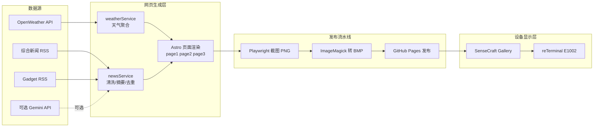

# reTerminal E1002 Web-only Multi-page Dashboard

这是一个给 reTerminal E1002 用的纯 `web` 方案，不需要 `arduino/`。  
核心思路是：不在设备上做重计算，而是在 GitHub 上定时生成 3 张最新页面（最终是 BMP），设备只负责显示。

## 1) 外行版：这个项目到底做了什么

- `Page1`：东京天气（今天+未来3天）+ 全局重点新闻标题
- `Page2`：3 条重点 Gadget 新闻简报（自动摘要、自动去噪、自动去重）
- `Page3`：全屏图片（默认 `./DSC_2962.jpg`）
- 页面会自动轮播，适合 ePaper 看板场景

## 2) 一张图看懂整体架构

## 3) 实现原理（深入浅出）

### 3.1 数据怎么来

- 天气：调用 OpenWeather 的 5-day/3-hour 预报接口（免费可用），再聚合成“天级别”信息
- 新闻：从 RSS 拉取 XML，解析出标题、时间、来源、链接、简介
- 摘要：优先使用 Gemini（若配置了 key），否则自动切换为本地抽取式摘要

对应代码：
- `web/src/apis/weather.ts`
- `web/src/apis/news.ts`
- `web/src/services/weatherService.ts`
- `web/src/services/newsService.ts`

### 3.2 新闻为什么现在更干净

`newsService` 里做了多层处理，避免“乱码、噪声、重复、截断”：

- 去噪：清除 `javascript:`、时间戳、作者/编辑/来源等非正文信息
- 去回声：去掉标题与正文的重复段、重复句
- 去重：同一轮候选新闻做近似去重（标题签名、关键词、设备名）
- 跨刷新去重：用历史缓存优先选择“上一轮没出现过”的新闻
- 长度控制：摘要字数收敛到可读区间，避免太短/太长

对应代码：
- `web/src/services/newsService.ts`

### 3.3 页面为什么能适配 ePaper

- 画布固定 `800x480`，字体、边框、色彩按 ePaper 可读性设计
- Page2 的标题和摘要使用自适应字体策略，尽量避免显示不完整
- Page3 图片单独走保色策略（truecolor BMP），避免过暗和失真

对应代码：
- `web/src/styles/global.css`
- `web/src/styles/cyber-page.css`
- `web/src/pages/page1.astro`
- `web/src/pages/page2.astro`
- `web/src/pages/page3.astro`

### 3.4 轮播是怎么实现的

- `/` 页面只放一个 `iframe`
- 通过 `?p=1/2/3` 控制当前页
- 到时间后自动跳到下一页，形成循环

对应代码：
- `web/src/pages/index.astro`

## 4) 自动更新与部署机制

- 触发方式：
  - `push main` 立即构建
  - 手动触发 workflow
  - 定时任务每 30 分钟一次
- CI 流程：
  - `astro build` 生成静态页
  - Playwright 截图 `page1/2/3.png`
  - ImageMagick 转 `page1/2/3.bmp`
  - 发布到 GitHub Pages

对应代码：
- `.github/workflows/pages.yml`
- `web/scripts/screenshot/index.ts`

## 5) 输出结果与设备接入

发布后可直接访问：

- `https://<your-user>.github.io/<your-repo>/page1.bmp`
- `https://<your-user>.github.io/<your-repo>/page2.bmp`
- `https://<your-user>.github.io/<your-repo>/page3.bmp`

在 SenseCraft 里推荐用 `Gallery` 组件，填入这 3 个 URL 做轮播显示。

## 6) 关键目录速览

- `web/src/pages`：3 个页面 + 轮播入口页
- `web/src/services`：天气聚合、新闻清洗/摘要/去重核心逻辑
- `web/src/apis`：外部接口请求封装
- `web/scripts/screenshot`：自动截图脚本
- `.github/workflows/pages.yml`：自动构建发布流水线

## 7) 运行与配置

具体开发和命令说明见：

- `web/README.md`
