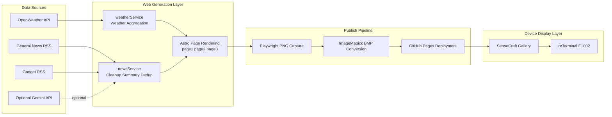

# reTerminal E1002 Web-only Multi-page Dashboard

This is a pure `web` solution for reTerminal E1002 and does not require `arduino/`.  
The core idea is: do not run heavy logic on-device. Instead, generate 3 up-to-date pages (BMP outputs) on GitHub at intervals, and let the device focus on display only.

## 1) Plain-English Overview

- `Page1`: Tokyo weather (today + next 3 days) + top general headlines
- `Page2`: 3 key gadget news briefs (auto-summary, auto-noise cleanup, auto-deduplication)
- `Page3`: full-screen image (default `./DSC_2962.jpg`)
- Pages auto-rotate, suitable for ePaper dashboard scenarios

## 2) Architecture at a Glance

## 3) How It Works

### 3.1 Data Input

- Weather: uses OpenWeather 5-day/3-hour forecast (free endpoint), then aggregates to day-level data
- News: fetches RSS XML and parses title/time/source/link/description
- Summaries: uses Gemini first (if key is configured), otherwise falls back to local extractive summarization

Code references:
- `web/src/apis/weather.ts`
- `web/src/apis/news.ts`
- `web/src/services/weatherService.ts`
- `web/src/services/newsService.ts`

### 3.2 Why News Output Looks Cleaner

`newsService` applies multiple passes to avoid garbled text, noise, duplicates, and truncation:

- Noise removal: strips `javascript:`, timestamps, byline/editor/source fragments, and similar clutter
- Echo removal: removes title/body repeated phrases and duplicate sentences
- In-batch deduplication: near-duplicate filtering by title signature, keywords, and device/entity cues
- Cross-refresh deduplication: uses a history cache to prioritize items not shown in the previous cycle
- Length control: enforces readable summary length bounds to avoid too short/too long output

Code reference:
- `web/src/services/newsService.ts`

### 3.3 Why It Fits ePaper

- Fixed canvas at `800x480` with typography/border/color tuned for ePaper readability
- Page2 title/summary use adaptive font sizing to reduce clipping
- Page3 uses a separate color-preserving path (truecolor BMP) to avoid darkening and detail loss

Code references:
- `web/src/styles/global.css`
- `web/src/styles/cyber-page.css`
- `web/src/pages/page1.astro`
- `web/src/pages/page2.astro`
- `web/src/pages/page3.astro`

### 3.4 Auto Rotation Logic

- `/` renders a single `iframe`
- `?p=1/2/3` controls the active page
- A timer advances to the next page, forming a loop

Code reference:
- `web/src/pages/index.astro`

## 4) Auto Update and Deployment

- Triggers:
  - `push main`: immediate build
  - manual workflow dispatch
  - scheduled run every 30 minutes
- CI flow:
  - `astro build` generates static pages
  - Playwright captures `page1/2/3.png`
  - ImageMagick converts to `page1/2/3.bmp`
  - artifacts are deployed to GitHub Pages

Code references:
- `.github/workflows/pages.yml`
- `web/scripts/screenshot/index.ts`

## 5) Outputs and Device Integration

After deployment, access:

- `https://<your-user>.github.io/<your-repo>/page1.bmp`
- `https://<your-user>.github.io/<your-repo>/page2.bmp`
- `https://<your-user>.github.io/<your-repo>/page3.bmp`

In SenseCraft, the recommended approach is the `Gallery` component with these 3 URLs for rotation.

## 6) Key Directories

- `web/src/pages`: 3 pages + rotation entry page
- `web/src/services`: weather aggregation + news cleanup/summary/dedup core logic
- `web/src/apis`: external API wrappers
- `web/scripts/screenshot`: screenshot automation script
- `.github/workflows/pages.yml`: build and deployment pipeline

## 7) Run and Configure

For detailed commands and local setup:

- `web/README.md`
